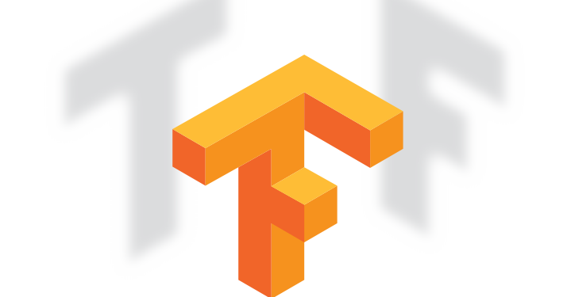

TensorFlow™ is an open source software library for numerical computation using data flow graphs. Nodes in the graph represent mathematical operations, while the graph edges represent the multidimensional data arrays (tensors) communicated between them. The flexible architecture allows you to deploy computation to one or more CPUs or GPUs in a desktop, server, or mobile device with a single API. TensorFlow was originally developed by researchers and engineers working on the Google Brain Team within Google's Machine Intelligence research organization for the purposes of conducting machine learning and deep neural networks research, but the system is general enough to be applicable in a wide variety of other domains as well.

* Official GiHub Repo of TensorFlow: https://github.com/tensorflow/tensorflow
* Models and examples built with TensorFlow: https://github.com/tensorflow/models
* Getting Started with TensorFlow: https://www.tensorflow.org/get_started/
* Official Tutorials of TensorFlow: https://www.tensorflow.org/tutorials/
* Programmer's Guide for using TensorFlow: https://www.tensorflow.org/programmers_guide/
* TensorFlow Performance: https://www.tensorflow.org/performance/
* TensorFlow Mobile Deployment: https://www.tensorflow.org/mobile/
